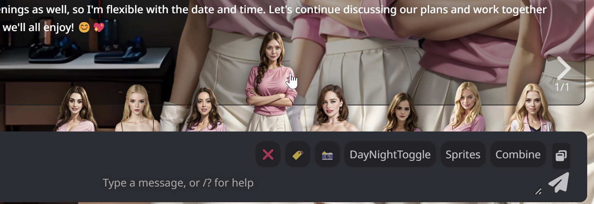

# Trigger Cards

Displays small interactive portraits of all group chat members on top of the chat input bar.

## Basic Usage

All settings are saved to the active chat.

- `/tc-on` to enable trigger cards.
- `/tc-off` to disable trigger cards.
- `/tc?` to show this help.

By default, a trigger card is created for each group member with the following actions:

*   `click` – trigger the character to speak
*   `shift + click` – unmute the character
*   `alt + click` – mute the character

To restore these default settings use `/tc-on reset=true`

## Custom cards

Instead of the member list, you can use a custom list of cards by either providing the name of a Quick Reply set (the labels of the quick replies will be used as character names and to find the corresponding expression images, add `::qr` to the label to execute the quick reply on click instead of the normal click action) or by providing a comma-separated list of names.

`/tc-on members=myQrSet`

`/tc-on Name1, Name2, Name3`

## Custom actions

To use another set of actions on the cards, you can provide the name of a Quick Reply set.

`/tc-on actions=myQrSet`

In the quick replies you can use `{{arg::name}}` to get the character's name.

`/trigger {{arg::name}}`

The quick replies should be labeled as follows (use the title field in the additional options dialog for the tooltip on the trigger card):

*   (empty label) – click (if you are using a QR set as member list, not providing this QR will result in a click calling the QR's command)
*   `c` – ctrl + click
*   `s` – shift + click
*   `a` – alt + click
*   `cs` – ctrl + shift + click
*   `ca` – ctrl + alt + click
*   `sa` – shit + alt + click
*   `csa` – ctrl + shift + alt + click
